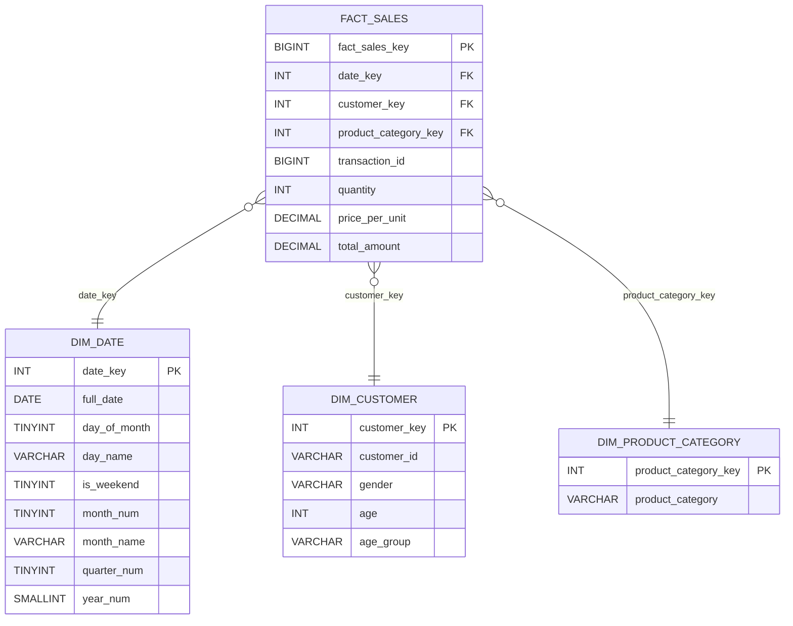
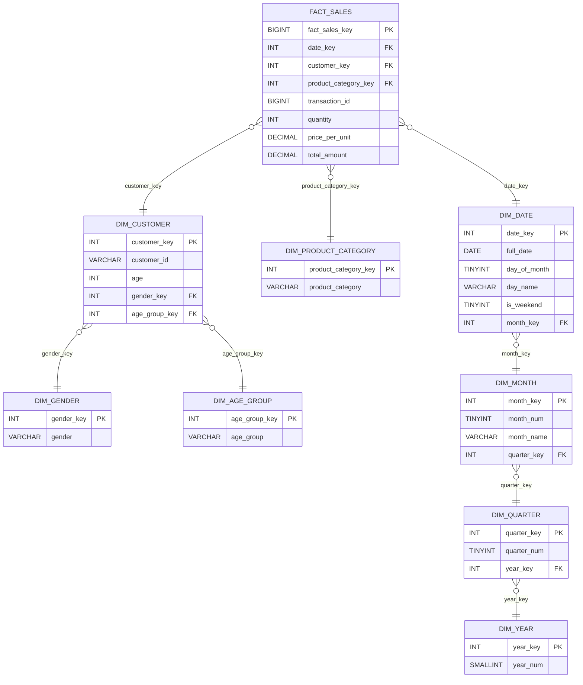

# Schema diagrams - Retail_sales

Paste each block into https://mermaid.live or view it in VS Code/GitHub. For the lab record use the `.drawio` files.

## Star schema

```mermaid
erDiagram
    FACT_SALES }o--|| DIM_DATE : "date_key"
    FACT_SALES }o--|| DIM_CUSTOMER : "customer_key"
    FACT_SALES }o--|| DIM_PRODUCT_CATEGORY : "product_category_key"
    FACT_SALES {
        BIGINT fact_sales_key PK
        INT date_key FK
        INT customer_key FK
        INT product_category_key FK
        BIGINT transaction_id
        INT quantity
        DECIMAL price_per_unit
        DECIMAL total_amount
    }
    DIM_DATE {
        INT date_key PK
        DATE full_date
        TINYINT day_of_month
        VARCHAR day_name
        TINYINT is_weekend
        TINYINT month_num
        VARCHAR month_name
        TINYINT quarter_num
        SMALLINT year_num
    }
    DIM_CUSTOMER {
        INT customer_key PK
        VARCHAR customer_id
        VARCHAR gender
        INT age
        VARCHAR age_group
    }
    DIM_PRODUCT_CATEGORY {
        INT product_category_key PK
        VARCHAR product_category
    }
```

## Snowflake schema

```mermaid
erDiagram
    FACT_SALES }o--|| DIM_CUSTOMER : "customer_key"
    DIM_CUSTOMER }o--|| DIM_GENDER : "gender_key"
    DIM_CUSTOMER }o--|| DIM_AGE_GROUP : "age_group_key"
    FACT_SALES }o--|| DIM_PRODUCT_CATEGORY : "product_category_key"
    FACT_SALES }o--|| DIM_DATE : "date_key"
    DIM_DATE }o--|| DIM_MONTH : "month_key"
    DIM_MONTH }o--|| DIM_QUARTER : "quarter_key"
    DIM_QUARTER }o--|| DIM_YEAR : "year_key"
    FACT_SALES {
        BIGINT fact_sales_key PK
        INT date_key FK
        INT customer_key FK
        INT product_category_key FK
        BIGINT transaction_id
        INT quantity
        DECIMAL price_per_unit
        DECIMAL total_amount
    }
    DIM_DATE {
        INT date_key PK
        DATE full_date
        TINYINT day_of_month
        VARCHAR day_name
        TINYINT is_weekend
        INT month_key FK
    }
    DIM_MONTH {
        INT month_key PK
        TINYINT month_num
        VARCHAR month_name
        INT quarter_key FK
    }
    DIM_QUARTER {
        INT quarter_key PK
        TINYINT quarter_num
        INT year_key FK
    }
    DIM_YEAR {
        INT year_key PK
        SMALLINT year_num
    }
    DIM_GENDER {
        INT gender_key PK
        VARCHAR gender
    }
    DIM_AGE_GROUP {
        INT age_group_key PK
        VARCHAR age_group
    }
    DIM_CUSTOMER {
        INT customer_key PK
        VARCHAR customer_id
        INT age
        INT gender_key FK
        INT age_group_key FK
    }
    DIM_PRODUCT_CATEGORY {
        INT product_category_key PK
        VARCHAR product_category
    }
```
